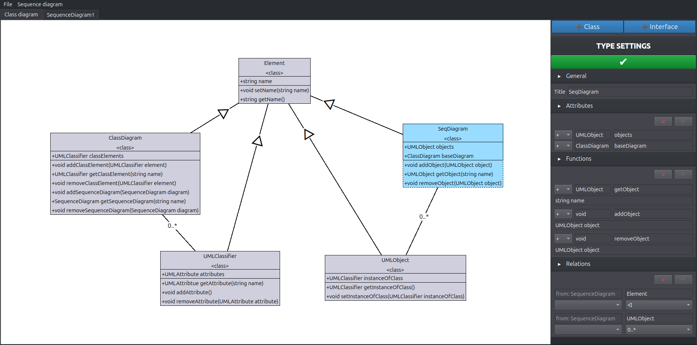
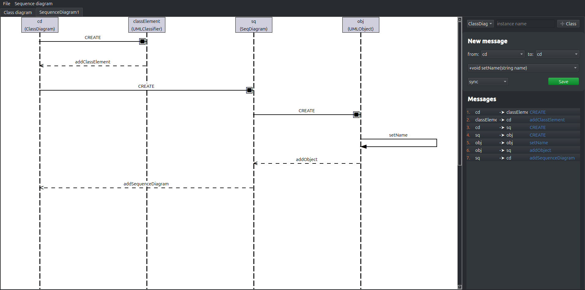

# ICP Project 2021/22 Implementation

## Authors
- Hung Do (xdohun00)
- David Kedra (xkedra00)

## Project Description
A Qt-based application for creating, editing, and managing UML class and sequence diagrams. Supports interactive element manipulation, relationship editing, and saving/loading diagrams in JSON format.

## Example Images
### Class Diagram


### Sequence Diagram


## Prerequisites
- Make
- CMake
- Qt5

## Build & Run
A `Makefile` is included in the root directory for building and running the application.

```bash
# Compile the program
make

# Compile and run
make run

# Generate documentation
make doc

# Clean generated files
make clean
```

## Application Usage
Upon launching the application, a new instance of a class diagram is created. Using the right panel, the user can create new class diagram elements. Each element appears on the canvas, where it can be moved freely. Selecting an element allows the user to edit its attributes and relationships. To save changes, click the green check button.

Sequence diagrams can be added from the top panel under `Sequence diagram -> Add`. A new sequence diagram instance opens in a new tab, where objects and messages can be added. All edits are performed through the right panel.

To delete individual elements, select them and press `DELETE`. Sequence messages can be deleted by double-clicking the message in the right panel list.

## Saving and loading
The program supports saving and loading diagrams in JSON format. Use `Ctrl+S` to save and `Ctrl+O` to load files.
